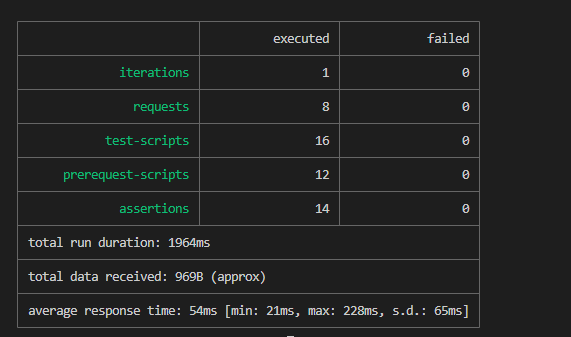

### **API testing with postman & report is generated by newman **

- #### 01 [API testing Postman Collection](https://www.getpostman.com/collections/f5f9e8f2ad24afec42af)

- #### 02 [API testing Postman Documentation](https://documenter.getpostman.com/view/21495292/UzBsGigX)

### **The instructions for project run are given below:**

- #### 01 Clone this project

- #### 02 Open with any code editor (Ex-VS Code) and 

- #### 03 Open project folder from the top menu by click on >file>open folder

- #### 04 Open terminal inside the project folder

- #### 05 Follow the command below to run the Collection Run Jason file

- #### 06 npm install/ npm i or yarn install

- #### 07 npx newman run .collection/my_task_collection.json

- #### 08 npm test or yarn test

- #### **Find the attachment of report preview**

